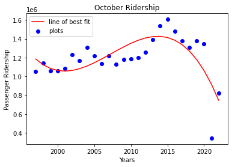
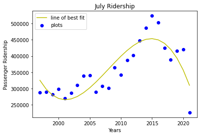
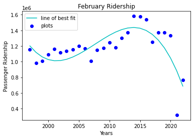
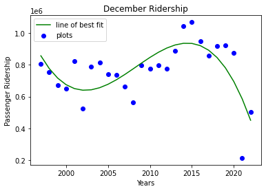
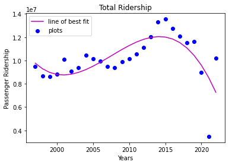

# Champaign-Urbana Bus Ridership Analysis & Prediction
## Contributors:
- ### Louis Sungwoo Cho


# Project Description


#### A 5W GREEN hopper bus approaches a bus stop shown above. 
- Image source: https://yourewelcomecu.com/cumtd-bus-photos/


This project is about analyzing and predicting the ridership of the buses in the Champaign-Urbana area operated by the Champaign-Urbana Mass Transit District also known as CUMTD. Datasets were acquired from the official Champaign County Regional Data Portal which could be found here:
- https://data.ccrpc.org/da_DK/dataset/transit-ridership

Datasets from the years 1997 to 2022 and months of July, October, December and February were used to analyze and predict the passenger volume for the bus.


The image above shows the CUMTD bus network that connects Campustown, Champaign and Urbana. Image downloaded from:
- https://mtd.org/maps-and-schedules/maps/

As shown in the image above, the CUMTD bus network is very dense connecting almost all the popular places visited by many passengers.


# Motivation


As an undergraduate student who is majoring in civil engineering specializing in transportation engineering and minoring in computer science at UIUC, I would frequently use the CUMTD bus to travel around campus. Either to go to I-Hotel so I could attend civil engineering conferences or go to the South Quad which is very far from the Engineering area (CIF, Grainger Library, Newmark CEE Laboratory, Thomas Siebel Center for CS, ECEB, Sidney Lu MEB, the list goes on). I would also ride the bus to go to downtown Champaign and Urbana to get some delicious food too! I always wondered what the daily ridership would be for these buses and whether the ridership would increase or not.


# Monthly Ridership Trend Analysis


This section analyzes the passenger riderhip trend in four different months: October, July, February and December in addition to the total number of passengers with respect to years. Each data was analyzed separately and the linear regression method was called to determine the line of best fit for each figure shown below. A degree of 1, 2, and 3 were set to determine which degree produces the closest line of best fit according to the data plotted in a scatter plot.





#### Figure 1. above shows the yearly ridership of the CUMTD bus during the month of October





####                      Figure 2. above shows the yearly ridership of the CUMTD bus during the month of July





#### Figure 3. above shows the yearly ridership of the CUMTD bus during the month of February





#### Figure 4. above shows the yearly ridership of the CUMTD bus during the month of December





#### Figure 5. above shows the total yearly ridership of the CUMTD bus


Although all the figures above called the function to perform data analysis and determine the line of best fit using the linear regression method, the data scattered shows that the trend line approximately matches the plots using the degree of 3. Thus, polynomial regression is more suitable for the analyzed dataset. According to the monthly bus ridership plots with respect to time in years, there is an increasing trend. However around the year 2020, there has been a significant drop in monthly ridership and the total ridership with respect to years due to the COVID-19 pandemic.


# Machine Learning and Dataset Training


To train the ridership data, classification models such as SVM, Decision Trees, Naive Bayes and Logistic Regression were used to process the data. The classification packages used to train the dataset are from the sklearn library.

```python

```
