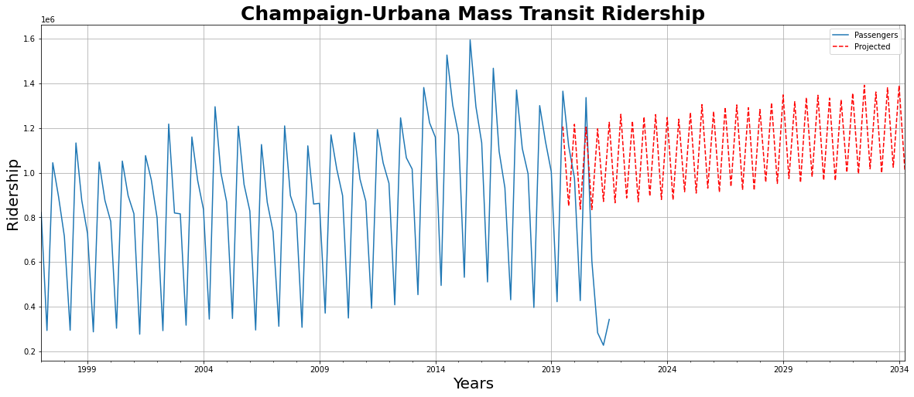

# Champaign-Urbana Bus Ridership Analysis & Prediction
## Contributors:
- ### Louis Sungwoo Cho

# Project Description

#### A 5W GREEN hopper bus approaches a bus stop shown above. 
- #### Image source: https://yourewelcomecu.com/cumtd-bus-photos/

This project is about analyzing and predicting the ridership of the buses in the Champaign-Urbana area operated by the Champaign-Urbana Mass Transit District also known as CUMTD. Datasets were acquired from the official Champaign County Regional Data Portal which could be found here:
- https://data.ccrpc.org/da_DK/dataset/transit-ridership

Datasets from the years 1997 to 2022 and months of July, October, December and February were used to analyze and predict the passenger volume for the bus.

The image above shows the CUMTD bus network that connects Campustown, Champaign and Urbana.
- #### Image source: https://mtd.org/maps-and-schedules/maps/

As shown in the image above, the CUMTD bus network is very dense connecting almost all the popular places visited by many passengers.

# Motivation

The Champaign-Urbana Mass Transit District also known as (CUMTD) serves as a great public transportation system throughout the entire University of Illinois at Urbana-Champaign area and a crucial type of mobility for university students to travel around on campus. From Grainger Library, Campus Instructional Facility (CIF), Newmark Civil Engineering Laboratory, Thomas Siebel Center for Computer Science, Electrical & Computer Engineering Building, Sidney Lu Mechanical Engineering Building to Business Instructional Facility, Altgeld Hall, Main Library, Foellinger Auditorium and many more wonderful places, you could almost travel anywhere by using the CUMTD buses. People even use the buses to go to downtown Champaign or to downtown Urbana to get some delicious food or to even go shopping, watch movies and even to enjoy some karaoke. As an Undergraduate Computational Transportation Scientist at UIUC, I decided to perform a traffic capacity analysis on the passenger ridership volume of the CUMTD buses and to perform time series forecasting to estimate the predicted passenger volume in the near future.

# Monthly Ridership Trend Analysis

This section analyzes the passenger riderhip trend in four different months: October, July, February and December in addition to the total number of passengers with respect to years from 1997 to 2021. A scatter plot including all the monthls and the total bus ridership passenger analyzed from the years 1997 to 2021 were also plotted.

#### Figure 1. shows the mean, standard deviation, minimum value, 25 percentile, 50th percentile, 75th percentile and the maximum values respectively for each month analyzed and the total passenger ridership.

#### Figure 2. above shows the scatter plot of all the data including both months and total ridership.

#### Figure 3. above shows the ridership of the CUMTD bus broken down into months.

Datasets were then further broken down into months and total ridership to determine the line of best fit for all the plotted data points. The following figure shows a polynomial regression of degree 3 line curve plotted with respect to the analyzed data.

#### Figure 4. above shows the line of best fit for the October passenger ridership with respect to the years from 1997 to 2021.

#### Figure 5. above shows the line of best fit for the July passenger ridership with respect to the years from 1997 to 2021.

#### Figure 6. above shows the line of best fit for the February passenger ridership with respect to the years from 1997 to 2021.

#### Figure 7. above shows the line of best fit for the December passenger ridership with respect to the years from 1997 to 2021.

#### Figure 8. above shows the line of best fit for the total passenger ridership with respect to the years from 1997 to 2021.

Although all the figures above called the function to perform data analysis and determine the line of best fit using the linear regression method, the data scattered shows that the trend line approximately matches the plots using the degree of 3. Thus, polynomial regression is more suitable for the analyzed dataset. According to the monthly bus ridership plots with respect to time in years, there is an increasing trend. However around the year 2020, there has been a significant drop in monthly ridership and the total ridership with respect to years due to the COVID-19 pandemic.

# Data Cleaning 

#### Figure 9. above shows the data that needs to be cleaned.

The given dataset by the Champaign County Regional Data Portal neede some cleaning to be fitted appropriately for the time series forecasting model. The months had to be aligned sequentially with respect to each year from 1997 to 2021. New dataframe had to be created using the Pandas library. Months had to be adjusted in sequential order. To make the datasets consistent with the appropriate sequence, the dates have been adjusted by default to the starting day of that specific given month for each year. Pandas has another function which converts the independent variable to date and time format. The modified data frame was used for the time series analysis and forecasting for passenger volume. 

### Figure 10. above shows the modified time data frame.

### Figure 11. above shows the estimator for traffic trend analysis.

An estimator curve was plotted to mathematically analyze the trend of the passenger volume of the CUMTD buses.The blue lines represent the recorded passenger ridership by the Champaign County Portal. The orange line shows the estimator line to approximate the passenger trend of the CUMTD buses. 

# Machine Learning and Dataset Training

Datasets were split into training datasets and testing datasets in the model. They were used to predict the total passenger ridership for each year with respect to the given months. 90% of the datasets were used for training and 10% of the datasets were used for testing the model. Once the predictions were made, three methods to test the performance of the model were used: Mean Absolute Error, Mean Squared Error, and Root Mean Squared.

This is the formula for the Mean Absolute Error (MAE)

$$ MAE\ =\ \frac{1}{n} \sum_{i=1}^{n} \ |y_i\ -\ \hat{y}_i| \ $$

This is the formula for the Mean Squared Error (MSE)

$$ MSE\ =\ \frac{1}{n} \sum_{i=1}^{n} \ (y_i\ -\ \hat{y}_i)^2 \ $$

This is the formula for the Root Mean Squared Error (RMSE)

$$ RMSE\ =\ \sqrt{ \sum_{i=1}^{n} \ \frac{(y_i\ -\ \hat{y}_i)^2} {n}}   \ $$

The values for MAE, MSE, and RMSE are shown below

$$ MAE \= 551616.0835039305 \$$

$$ MSE \= 373232104920.6135 \$$

$$ RMSE \= 610927.2501048006 \$$

Due to the fluctuation in the time series graph, there is a significant difference between the actual and trained datasets. According to the results above, the MAE is better for approximation for this passenger volume model. 

### Figure 12. above shows the trained and tested datasets and prediction estimator.

# Time Series Forecasting

Finally, using a moving average, forecasting of the ridership of CUMTD buses was performed. After fitting the given model of passenger volume training datasets with the moving average, 60 seasonal periods were forecasted including previous data from 2017 to predicted passenger volume in 2034. Once the forecasting was complete, the forecasted data was plotted on the same graph as the historical data that were used to train and predict the future passenger volume. 

###  Figure 13. above shows the forecasted passenger volume until 2034 broken into 60 seasonal parts.

### Figure 14. above shows the graph of the projected passenger volume until 2034 and the historical data.

# Conclusive Remarks

The dataset for the Champaign-Urbana Mass Transit bus passenger ridership volume from the official Champaign County Regional Data Portal was initially used to analyze the monthly ridership with respect to years to determine which month has the highest volume of passengers. The given dataset was then cleaned and parsed to perform time series forecasting to predict future passenger volume of the CUMTD buses. Each year from 1997 to 2021 has four months (February, July, October, and December) and passenger volume with respect to each month of the yearly period. The sequential datasets were then used for both training and testing to generate an estimator to forecast the future volume of passenger ridership. The historical results show that there has been a drastic drop in the year 2020 due to COVID 19 pandemic. The predictor estimates that the projected passenger volume from 2022 to 2034 is approximately between 800000 and 1400000 passengers. Based on this prediction, passenger ridership of the CUMTD buses will be steady unless there is a big pandemic.

### A 5W bus bound for Round Barn RD waits infront of Sidney Lu Mechanical Engineering Building shown above.
